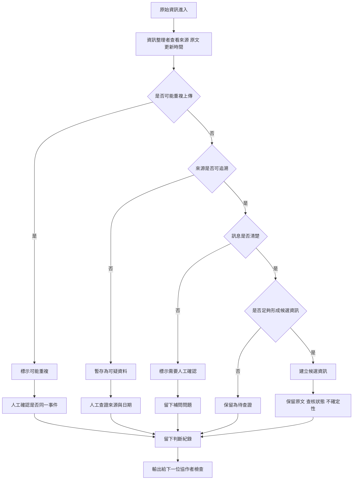

# 資訊流程設計

> 這份文件用來把 v1 的資料整理流程說清楚，並保留人工確認點與不能自動處理的分支。

## 我的 v1 目標

- 我優先服務的使用者：資訊整理者
- 這個使用者最想完成的事：像資料轉運站一樣，判斷原始資訊是否足夠進入候選，並在保留不確定性的情況下整理出可檢查的候選資訊。
- 我最想避免的錯誤：把未確認資訊直接當成可執行任務，或讓 AI 自動補完缺失細節。

## 自然語言流程描述

原始資訊進來後，資訊整理者先查看來源、原文、更新時間與既有紀錄。這一站像資料轉運站，不負責直接決定真偽或派工，而是判斷資料應該被補問、暫存、標示關聯，還是形成候選資訊。

第一步先檢查是否可能重複上傳。如果看起來和既有資料描述同一件事，資訊整理者不直接新增任務，也不自動合併，而是標示可能重複，人工確認哪一筆較新、哪一筆來源較接近現場。

第二步檢查是否可能是偽造或不可追溯資料，例如截圖沒有日期、公告沒有來源、轉傳內容沒有原始發布者。這類資料不能自動處理，也不能被當成已確認，只能暫時保留並要求人工查證來源。

第三步檢查訊息是否模糊。如果缺少明確地點、時間、當事人、數量或需求範圍，就標示為需要人工確認，並留下補問問題。

如果資料通過上述檢查，資訊整理者才建立候選資訊。候選資訊仍保留原文、資訊取得方式、查核狀態、不確定性與判斷理由。候選資訊不是可執行任務，也不能被顯示成已確認。

每次判斷都要記錄來源、判斷理由、人工確認問題和目前狀態，讓下一位協作者知道資料為什麼被轉送、暫存或擋下。

## Mermaid 流程圖

## 為什麼這樣畫

- 從「原始資訊進入」開始，是為了提醒 v1 面對的是未整理資料，不是整理後資料，也不是已確認任務。
- 先讓資訊整理者查看來源、原文與時間，是因為他像資料轉運站；他要保留資料脈絡，不能只看 AI 摘要或候選分類。
- 第一個分支先檢查重複上傳，因為重複資料會讓同一件事看起來像多個需求，後續可能造成重複派人或重複送物資。
- 第二個分支檢查來源是否可追溯，是為了擋下偽造資料、過期截圖或無法確認的轉傳內容；這些資料不能因為格式像公告就被相信。
- 第三個分支檢查訊息是否清楚，是為了處理「那邊」「疑似」「先不要再派人」這類模糊說法，避免整理者或 AI 自動補出原文沒有的內容。
- 只有通過前面檢查後才建立候選資訊，是為了讓候選維持「可檢查」而不是「可執行」。候選資訊仍保留查核狀態與不確定性。
- 所有分支最後都留下判斷紀錄，是為了讓下一位協作者知道這筆資料為什麼被標示、暫存或轉送，而不是重新猜一次。

## 人工確認點

- 是否可以信任這筆原始資訊的來源。
- 是否與既有資料重複，或只是同一事件的不同說法。
- 截圖、公告或轉傳內容是否有可追溯來源與日期。
- 模糊資訊需要補問誰、補問什麼。
- 是否這筆資訊足夠形成候選結果。
- 是否這筆候選資訊會誤導後續行動者。

## 不能自動處理的分支

- AI 不應該自動把模糊或不足的資訊標為已確認。
- AI 不應該自動決定哪些候選資訊可以直接用於行動。
- AI 不應該自動補完缺失的地點、數量或需求類型。
- AI 不應該自動合併重複上傳資料，因為可能有時間差或來源差異。
- AI 不應該把無法追溯的截圖或公告當成可信資料。

## 操作或判斷紀錄

- 記錄每筆資料的來源與原文字。
- 記錄每次轉換成候選或標示為需要確認的理由。
- 記錄可能重複、可疑來源、訊息模糊等判斷。
- 記錄人工確認需要補問的問題。
- 記錄草稿建立、編輯、重設與刪除的動作。

## 我檢查後修正了什麼

- 原本：流程描述沒有明確說明「原始資訊不能直接當成任務」。
- 修正後：新增流程步驟，強調先判斷來源與內容是否足夠，並保留「需要人工確認」狀態。
- 為什麼：這更符合資訊整理者優先的 v1 方向，避免誤導後續行動者。

- 原本：流程圖只檢查來源與內容是否清楚，沒有呈現小隊復盤提到的重複上傳、偽造資料、訊息模糊。
- 修正後：新增三個分支：可能重複上傳、來源不可追溯、訊息不清楚，並都導向人工確認或待查證紀錄。
- 為什麼：資訊整理者像資料轉運站，必須先擋下或標記高風險資料，不能讓它們被自動轉成候選或任務。

- 原本：流程描述提到「合併、拒絕」，容易讓人以為系統可以直接完成正式處置。
- 修正後：改成「標示關聯、暫存、待查證」，並在重複資料分支中要求人工確認是否同一事件。
- 為什麼：目前 v1 只做資訊整理與風險標記，不應自動合併資料或做最終拒絕判斷。

## 我仍不確定的流程點

- 是否需要把「原始資訊」「候選資訊」「已確認資訊」放在同一頁面呈現。
- 如何讓資訊整理者在介面上快速看出哪筆資料最需要確認。
- 如果兩筆資料疑似重複，是否要提供合併草稿，還是只標示關聯並交給人確認。
- 對於可疑截圖或公告，是否需要獨立的「來源查證中」狀態。
