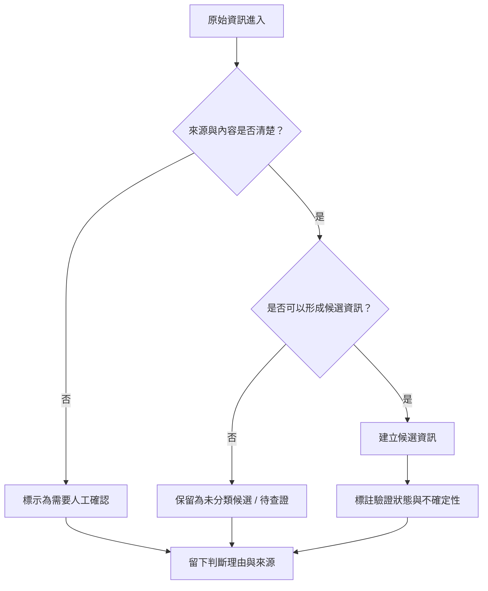

# 資訊流程設計

> 這份文件用來把 v1 的資料整理流程說清楚，並保留人工確認點與不能自動處理的分支。

## 我的 v1 目標

- 我優先服務的使用者：資訊整理者
- 這個使用者最想完成的事：判斷原始資訊是否足夠進入候選，並在保留不確定性的情況下整理出可檢查的候選資訊。
- 我最想避免的錯誤：把未確認資訊直接當成可執行任務，或讓 AI 自動補完缺失細節。

## 自然語言流程描述

原始資訊進來後，資訊整理者先查看來源與原文。
如果來源不清楚、內容不足或內容含糊，先把這筆資料標示為「需要人工確認」。
如果資訊可能誤導行動者，先不要把它變成候選任務，而是保留為候選資訊或待查證狀態。
如果資訊足夠形成候選結果，建立候選資料，同時保留其驗證狀態與不確定性標記。
每次判斷都要記錄來源、判斷理由和目前狀態，讓後續協作者知道這筆資料的信任程度。

## Mermaid 流程圖

## 人工確認點

- 是否可以信任這筆原始資訊的來源。
- 是否這筆資訊足夠形成候選結果。
- 是否這筆候選資訊會誤導後續行動者。

## 不能自動處理的分支

- AI 不應該自動把模糊或不足的資訊標為已確認。
- AI 不應該自動決定哪些候選資訊可以直接用於行動。
- AI 不應該自動補完缺失的地點、數量或需求類型。

## 操作或判斷紀錄

- 記錄每筆資料的來源與原文字。
- 記錄每次轉換成候選或標示為需要確認的理由。
- 記錄草稿建立、編輯、重設與刪除的動作。

## 我檢查後修正了什麼

- 原本：流程描述沒有明確說明「原始資訊不能直接當成任務」。
- 修正後：新增流程步驟，強調先判斷來源與內容是否足夠，並保留「需要人工確認」狀態。
- 為什麼：這更符合資訊整理者優先的 v1 方向，避免誤導後續行動者。

## 我仍不確定的流程點

- 是否需要把「原始資訊」「候選資訊」「已確認資訊」放在同一頁面呈現。
- 如何讓資訊整理者在介面上快速看出哪筆資料最需要確認。
