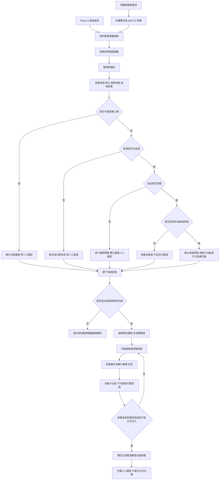
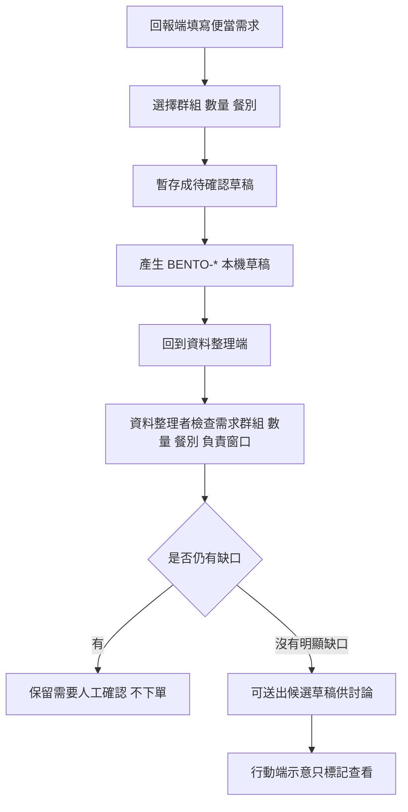
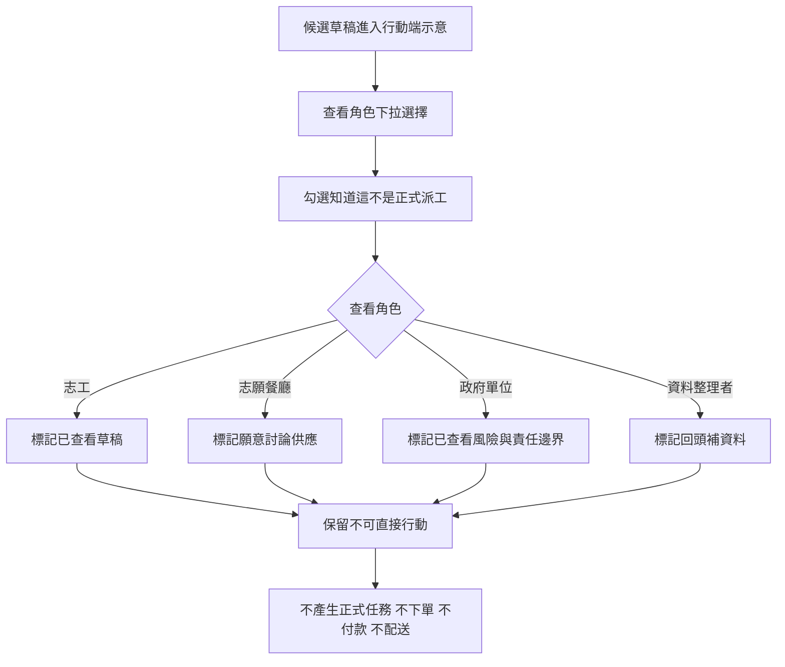
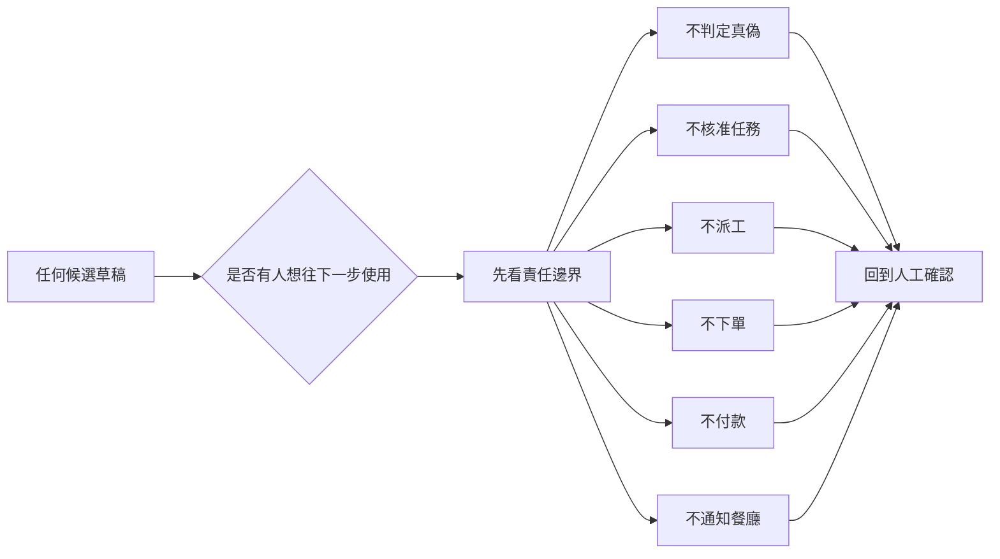

# 系統 Workflow 設計

> 這份文件重新整理目前前端原型的 workflow。重點不是建立正式救災流程，而是說清楚資訊如何從「未整理」走到「候選草稿」，以及在哪些地方必須停下來人工確認。

## Workflow 目標

- 讓使用者看懂三個端點的關係：回報端、資料整理端、行動端示意。
- 保留原文、資訊取得方式、查核狀態與判斷理由。
- 把「候選草稿」和「正式任務」分開。
- 讓行動端只能標記查看候選草稿，不能派工、下單、付款或配送。
- 用責任邊界提醒：系統不判定真偽、不核准任務、不代表政府或餐廳承諾。

## 角色定位

| 端點       | 目前用途                             | 不能做的事                                   |
| ---------- | ------------------------------------ | -------------------------------------------- |
| 回報端     | 示範便當需求如何本機暫存成草稿。     | 不送出真實訂單、不通知餐廳、不收個資。       |
| 資料整理端 | 主流程。檢查來源、原文、缺口與風險。 | 不把未確認資料改成已確認，不直接派工。       |
| 行動端示意 | 檢視候選草稿與供應風險。             | 不領取正式任務、不付款、不配送、不代表承諾。 |

## 整體 Workflow

## 便當需求 Workflow

### 為什麼這樣畫

- 回報端只做本機暫存，因為目前沒有後端、資料庫或外部訂購服務。
- `BENTO-*` 是草稿編號，不是訂單編號。
- 便當需求進入資料整理端後，仍要檢查數量、餐別、需求群組與負責窗口。
- 即使送到行動端，也只是候選草稿檢視，不代表餐廳已接受或志工已被派工。

## 行動端示意 Workflow

### 為什麼這樣畫

- 行動端示意不是正式派工系統，所以不使用「領取任務」作為核心語意。
- 角色下拉只是本機聲明，不是身分驗證或權限授權。
- 紅色「實行專案」只代表草稿已進入行動端檢視狀態，不代表正式派工或已確認。
- 對志願餐廳來說，「願意討論供應」不等於承諾訂單。
- 對志工來說，「標記已查看」不等於接受任務。
- 對政府或協調單位來說，畫面只呈現風險與責任邊界，不代表官方決策。

## 責任邊界 Workflow

## 人工確認點

- 來源是否可追溯。
- 是否可能重複上傳。
- 訊息是否模糊。
- 是否缺少時間、地點、數量、當事人或負責窗口。
- 回報端新增的便當需求是否只是本機草稿。
- 候選草稿是否仍有卡住點。
- 查看者是否理解這不是正式派工、訂單、付款或餐廳承諾。

## 不能自動處理的分支

- 不能自動把未確認資訊變成已確認。
- 不能自動把候選草稿變成正式任務。
- 不能自動通知志工、餐廳或外部服務。
- 不能自動合併疑似重複資料。
- 不能自動補真實地址、電話、人物或餐廳資料。
- 不能用角色下拉當成真實身分驗證或授權。

## 目前 UI 對應

| Workflow 節點      | UI 對應                                            |
| ------------------ | -------------------------------------------------- |
| 原始資訊檢查       | 資料整理端的整理儀表板、原始資訊、判斷追溯。       |
| 使用前提醒         | 拼圖校準閱讀提醒。                                 |
| 重複 / 來源 / 模糊 | 整理草稿區的轉送前檢核與快速套用組件。             |
| 候選草稿           | 草稿編輯與「送出候選草稿供討論」。                 |
| 回報端暫存         | 便當需求回報網站原型與 `BENTO-*` 草稿。            |
| 行動端示意         | 候選草稿檢視、查看角色、標記已查看草稿。           |
| 餐廳供應風險       | 示範可討論量、分配假設草稿、示範取餐時段。         |
| 責任邊界           | 首頁責任邊界區塊與行動端非訂單 / 非承諾 / 非付款。 |

## 講解時的重點句

- 這個 workflow 不是要把資訊變成任務，而是讓資訊在變成任務以前先停下來被檢查。
- 資料整理端是主流程，回報端和行動端只是用來示範資訊進出時可能造成的誤解。
- 每一次轉換都保留「需要人工確認」與「不可直接行動」。
- 行動端只能標記查看候選草稿，不能派工、下單、付款或配送。
